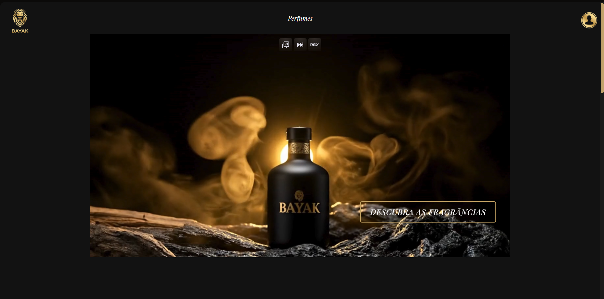

# 🛒 E-commerce de perfumes Bayak

Este projeto é uma plataforma de e-commerce para a perfumaria "Bayak", construído do zero para demonstrar habilidades de desenvolvimento full-stack.

O foco principal foi fazer um back-end robusto com **PHP** e um front-end com **HTML/CSS** focado na experiência do usuário.

---

## 📝 Funcionalidades Implementadas

### 1. Gerenciamento de Produtos (CRUD)
O back-end em PHP permite que um administrador tenha acesso a um CRUD completo para gerenciar o catálogo:

* **CREATE**: Cadastrar novos perfumes e suas categorias.
* **READ**: Ver todos os perfumes adicionados e seus detalhes.
* **UPDATE**: Alterar as informações de perfumes existentes.
* **DELETE**: Deletar perfumes do catálogo.

### 2. Sistema de Login (Hierarquia de Usuários)
O sistema possui dois níveis de acesso:

* **Cliente**: Pode ver os perfumes e as categorias.
* **Administrador**: Tem acesso ao painel de controle e ao CRUD completo.

### 3. Banco de Dados
* Todas as informações de produtos e usuários são guardadas de forma persistente através de um banco de dados **MySQL**.

### 4. Interface de Usuário
* O Front-End foi construído com **HTML5** e **CSS3** para garantir uma experiência de usuário responsiva e elegante.

---

## 🛠️ Tecnologias Utilizadas

* **Back-End**: PHP, JavaScript
* **Banco de Dados**: MySQL
* **Front-End**: HTML5, CSS3

---

## 💡 Próximos Passos e Melhorias

Este projeto foi focado na implementação da lógica de negócios (CRUD e Hierarquia de Usuários). Como próximos passos, planejo refatorar o código para implementar:

* **Prepared Statements**: Para prevenir SQL Injection e tornar as queries mais seguras.
* **Carrinho de Compras**: Para finalizar o fluxo de e-commerce.
